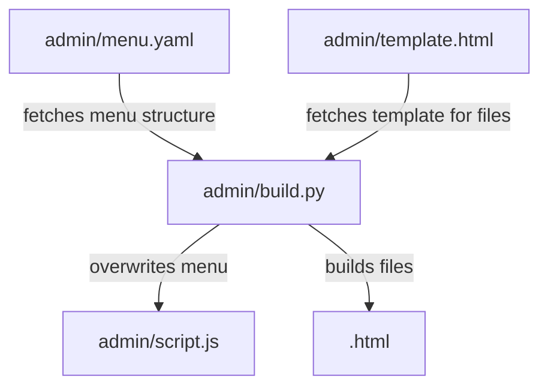

# Getting Started

To get a local copy up and running, follow these simple steps.

Prerequisites

- Basic knowledge of HTML and web development.
- A web browser to view the project.
- Optionally, a local server environment (like XAMPP, WAMP, or Python's HTTP server) if you want to simulate a more production-like environment.

Installation

1. Clone the repo or download the ZIP package.

```sh
git clone https://github.com/mhei-fub/mhei-fub.github.io
```

2. Extract the package (if downloaded as a ZIP) and navigate into the project directory.
3. Open the index.html file in your web browser to view the project. Alternatively, if using a local server, place the project in your server's root directory and navigate to it using your web browser.

# Project Structure



`.github/`: Contains GitHub-specific files, like workflows and actions, for project automation.

`admin/`: Holds administrative or configuration files crucial for the website's setup and maintenance.

`.html`: dedicated pages for each menu entry.

# Build script

Our project includes a Python script named `build.py` located in the `admin` directory, which plays a crucial role in the website's content management and generation process. This script is designed to automate the creation of HTML files based on structured data provided in YAML files, making it an essential tool for maintaining the site's navigation and content structure efficiently.

## How It Works

- **Parsing YAML Menu**: The script reads the YAML menu `menu.yaml`, which is used to organize and store the website's navigational data and content in a readable format. YAML is chosen for its ease of use and clarity, allowing non-technical contributors to easily understand and edit the content structure.
- **Generating HTML Files and Menus**: Based on the information extracted from the YAML file, `build.py` generates HTML files. For instance, it assigns `index.html` to the homepage and creates appropriately named HTML files for other pages, ensuring a seamless mapping between the site's content structure and its corresponding web pages. Moreover, it generates the navigation menu dynamically, incorporating the structure defined in the YAML files into the website's layout.
- **Customization and Extensibility**: The script is designed with flexibility in mind, allowing for easy updates to the website's structure or content by simply modifying the YAML files. This approach minimizes the need for direct HTML edits, streamlining content updates and site maintenance.

## Usage

To use the build script, navigate to the `admin` directory 

```sh
cd path/to/your/project/admin
```

And run:

```sh
python build.py
```

Ensure you have Python installed on your system and any dependencies required by the script, particularly the yaml module for parsing YAML files. 

```sh
pip install pyyaml
```

This script is a vital part of our project's infrastructure, automating the build process and enabling efficient site updates

# License

GNU GENERAL PUBLIC LICENSE Version 3, 29 June 2007

Joaquin Gottlebe - joa.gottlebe@gmail.com
